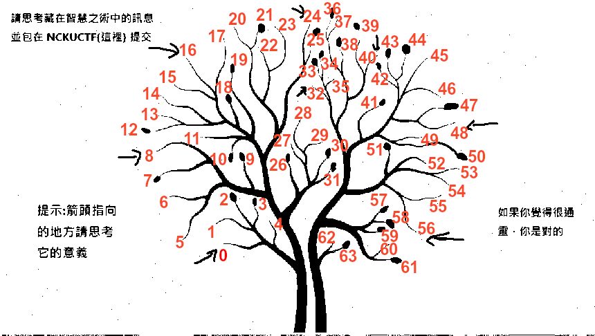

# 我們是做好駭客

medium
只是一位帥氣的好駭客的圖片?

(附件的圖片就是這題的 Challenge File)

Flag 格式: 你最終會從這張圖片解出一段文字，請提交 NCKUCTF{一段無空格的文字}

Author: pwn2ooown

這張圖片有兩關考驗 所以你還要解出下一關是什麼

Distribute good_hacker_chal.png

## Solution

First extract the lsb image (red layer I think) out you'll see the second stage. (you can use stegsolve or any tool you like, which is bad_hacker.jpg)

Count the branch clockwise and from the bottom left
If branch has leaf (or call it fruit if you like), it is 1. Otherwise it's zero.

Count all branches you'll get a bit string of 64 bits.

The arrow is the hint: it is the beginning of each 8 bit (ascii)

Source: <https://hackmd.io/@IID/ncku-ctf2024i-writeup#Misc-%E2%80%94-%E6%88%91%E5%80%91%E6%98%AF%E5%81%9A%E5%A5%BD%E9%A7%AD%E5%AE%A2>

Convert the bit string to ascii. The final message is `1h4cky0u`.
